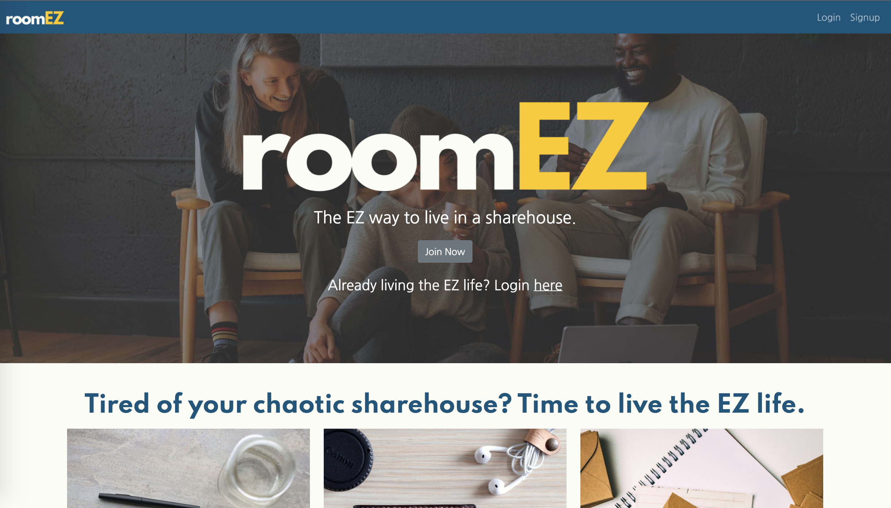

# roomEZ


This is roomEZ, the EZ way to live in a sharehouse. This is my final project at the University of Sydney coding bootcamp. 

You can access via [this link](https://roomez.herokuapp.com)



## Table of Contents 
* [Technology](#technology)
* [Features](#features)
* [User Story](#user-story)
* [Installation](#installation)

# Technology
This is a full stack MERN app featuring the following tech: 
- MongoDB
- Express
- React
- Node.js
- Mongoose
- Apollo
- GraphQL
- AWS S3
- JWT

# Features
- User creation: Users can create their own sharehouse or join an existing one using their unique code
- Bills: Occupants can create, assign, and pay bills, as well as see how much each needs to pay
- Chores: Occupants can create, assign, and complete chores with attached photos
- Messages: Leave a message for the next housemate to see, with photo functionality
- Dashboard: Homepage contains the key metrics you need to care about

For more information, see documentation on [this Google Drive folder](https://drive.google.com/drive/u/0/folders/13OBbt-Y_DcjtyzUp1RRRqvs-RiFyWnGS). 

# User Story

```md
As a resident living in a sharehouse with housemates
I want a mobile-friendly sharehouse website
So that we can be more organised in our daily lives
```

# Installation

You can use the following commands if you clone to your repo. Note that the file uploads won't work unless you put in your own AWS credentials. 
```md
npm install
npm run develop
```